# Bookstore Management System
  
## Table of Contents
#### [INTRODUCTION](#1)
- [1.1 Project Background](#11)
- [1.2 Objectives of Project](#12)
- [1.3 Purpose of Project](#13)
- [1.4 Scope of Project](#14)
- [1.5 Applicability of Project](#15)

#### [REQUIREMENT AND ANALYSIS](#2)
- [2.1 Problem Statement](#21)
- [2.2 Requirement specifications](#22)
- [2.3 Hardware requirement](#23)
- [2.4 Software Requirement](#24)
- [2.5 Planning and scheduling](#25)

#### [SYSTEM DESIGN](#3)
- [3.1 Over All System Design Using Designing Tools](#31)
- [3.2 Data dictionary](#32)
- [3.3 Input/Output design](#33)

#### [TESTING AND IMPLEMENTATION](#4)
- [4.1 Testing Approach Used](#41)
- [4.2 Test Cases](#42)
- [4.3 Implementation approaches](#43)

#### [CONCLUSION](#5)
- [5.1 Limitation of system](#51)
- [5.2 Future Scope of System](#52)
- [5.3 Bibliography](#53)
  

## Introduction

#### 1.1	Project Background
-	This Software allows the Admin to store the book details and the customer details.
-	Easier access to information like customer information and  availability.
-	Provide facility of storing data to reduce the paper work.
-	In Bookstore Management System Users can by a book and Admin shows their name and other background of the user.
-	A  new idea about Project how Bookstore Management System works.
For make a system computerized.

#### 1.2	Objectives of Project
-	To reduce the paper work.To make computerized system.
-	Increase operational speed.Faster searching as well as accuracy.
-	Large storage of data using database.
-	Manual process of vehicle purchase and sales on finance and cash and generate reports of model wise, weekly, monthly ,annual progress is so difficult so this project make is easier.
-	Speed and faster information retrieval.

#### 1.3 Purpose of Project
-	The main purpose of Book-store Management System is to focused on the solution of all the problems related to the paper work from the different reasons.
-	It provides a facility to handle all the activities at one place. With the help of this application, admin can perform different kind of operations at the same time and place.
-	Bookstore management System has an ability to keep the records safe related to Books.
-	We provide the best service in our website or focuses on user choice. We will improve new feat user can easily understand and trust our system.

#### 1.4 Scope of Project
-	The intentions of the system are to reduce over-time pay and increase the number of records that can be treated accurately; Requirements statements in this document are both functional and non-functional.
-	Correct and Accurate Searching that provides the result by applying search operation.
-	Customers can book a book with just few clicks.
-	Give flexibility admin to use database effectively and utilize the word, not pad and calculator Unambiguous and understandable by all level facilities effectively.
-	Unambiguous and understandable by all level.

#### 1.5 Applicability of Project:
-	For customers who want to buy books at anywhere or anytime.
-	Admin applicable for insert books, list of books.
-	Database is used for store and fetch data from or to the database so both users and admin can fetch or read data.

## Requirement And Analysis

#### 2.1 Problem Statement
-	So much Paper work
-	Process is much time consuming
-	Extra expense in paper work 
-	Large storage of data
-	Manual process of Vehicle purchase and sales on finance and cash and generate reports of model wise, weekly, monthly, annual progress is so difficulties.
-	Speed and faster information retrieval.
-	Accuracy and consistency in manual system is less.
-	Personal delay.
-	In manual system it is tedious task to search a particular record later after.
-	Increase the staff in test taken place and wasting of their precious time.

#### 2.2 Requirement Specification
##### Functionalities of Admin:
-	This Module includes the mainly following tasks:
-	Entry of Category.
-	Category List.
-	Add a New Book.
-	View Book.
-	View Message which Send by Client.
##### Functionalities of Client:
-	This Module includes the mainly following tasks:
-	View Books.
-	Add books to Cart. 
-	Search Books.
-	View or Add items in Cart.

#### 2.3	Hardware requirement
-	System type 32 bit Operating System.
-	Windows 7/8/8.1/10
-	Linux  Ubuntu / Light ubuntu
-	Mac OS
-	350MB RAM

#### 2.4	 Software Requirement
-	Wamp Server
-	MySQL
-	Browser
-	PHPMyAdmin
##### Client Side Tools
-	Processor : PC with a Dual core processor or above is- Recommended: 2.20 GHz processor.
-	RAM : 512 MB or onwards Recommended.
-	Hard Disk : 45 MB of available space required on system drive of available or more.  
-	Operating System : Windows or open source 32/64 bit operating system, or later versions.  Browser Mozilla Firefox 2.0 /Internet Explorer 8.0 Onwards / Google- Chrome.

#### 2.5	Planning and scheduling
Different amount of time may be required for each stage in the project cycle, depending on the particulars of the key aspect of the project cycle seem to recur during development process. The information obtained during the requirement gathering of pre-development phase provides the impetus for the requirement analysis and the information is further used in the design phase.
  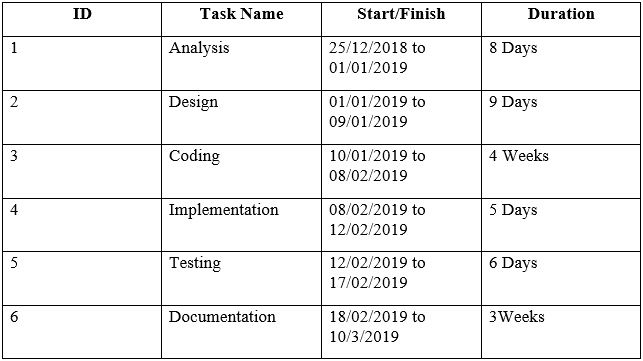
  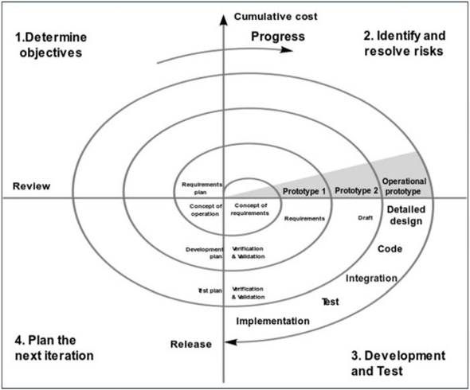

## System Design

#### 3.1 Over All System Design Using Designing Tools
- The Purpose of Design Phase is to plan a solution for problem specified by the requirements. System Design aims to identify the modules that should be in the system, the specification of those modules and how they interact with other to produce the results. The goal of the design process is to produce a model that can be used later to build that system. The produced model is called design of the system.
  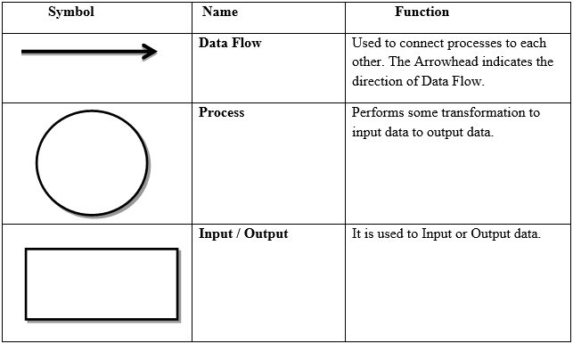
  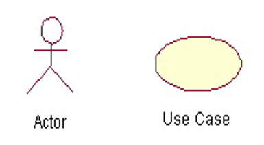

#### 3.2 Data Dictionary
-	Database Design & Structure Design
  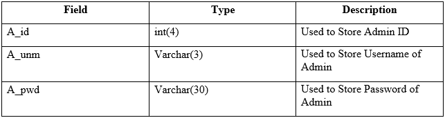
  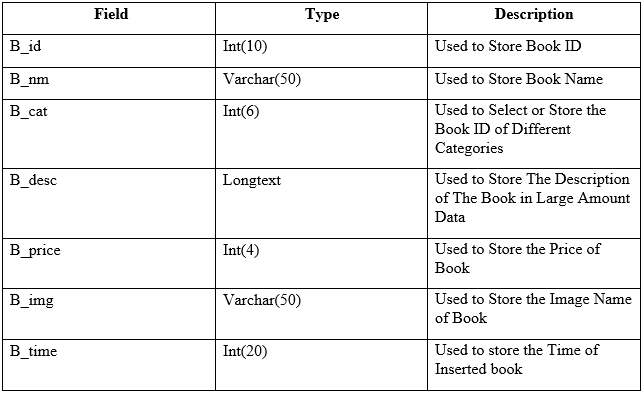
##### Various tables used in the System are as follows:
1.	Admin
2.	Book
3.	Category
4.	Contact
5.	Register
6.	Order
##### Detail of all the tables with its all the fields are as below:

#### 3.3 Input/Output Design
1.	Home Page
  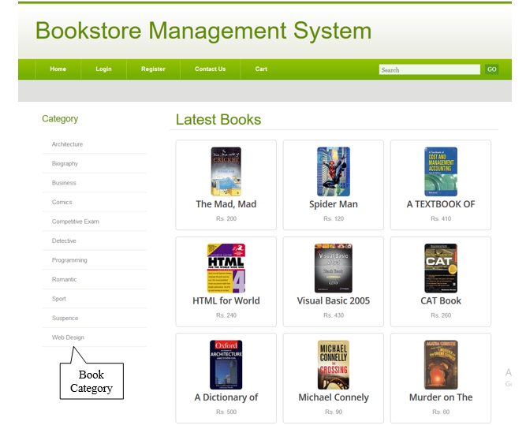
2.	Selected Category
  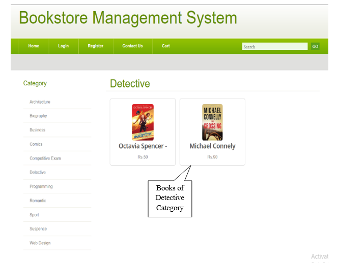
3.	Book Details (Before Login)
  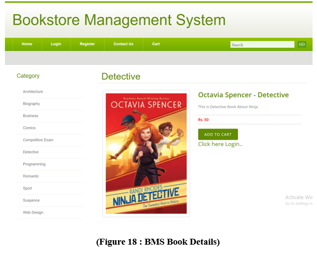
4.	Visitor Login Page
  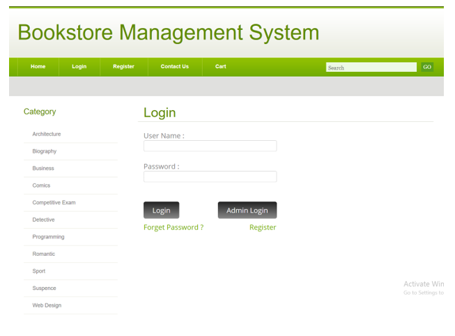
5.	Register Page
  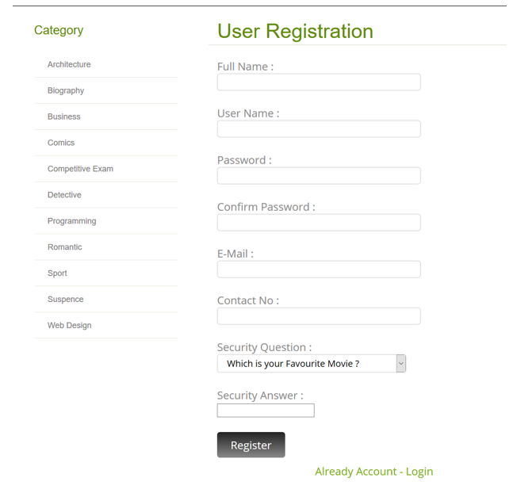
6.	Contact Us Page
  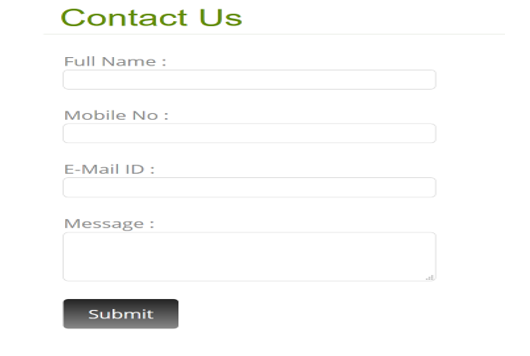

## Testing And Implementation

#### 4.1 Testing Approach Used
-	Black box testing
Black-box testing is a method of software testing that examines the functionality of  an application based on the specifications. It is also known as specifications based .
Testing Independent testing team usually perform this type of testing during   the software testing life cycle.
This method of test can be applied to each and every level of software testing such as unit, integration, system and acceptance testing.
  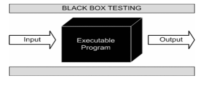
-	White box testing
White box testing is a testing technique That examines the program structure and derives test data from the program logic/code. The other names of glass box testing are clear box testing, open box testing, logic driven testing or path driven testing or structural testing.
-	Gray-box Testing: 
Grey-box testing is a testing technique performed with limited information about the internal functionality of the system. Grey-box testers have access to the detailed design information about requirements.
Grey box are generated based on the state based modes, UML diagrams or of the target system.
Grey Box Testing is a technique to test the software product or application with partial knowledge of the internal workings of an application.
  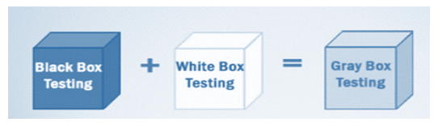

#### 4.2 Test Cases
##### 4.2.1 Admin Login Detail
  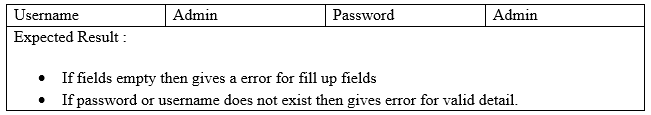
##### 4.2.2 Login Detail
  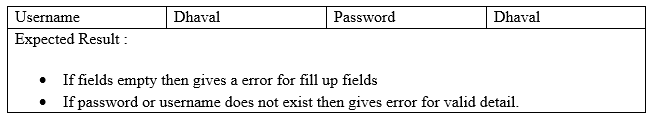
##### 4.2.3 Registration Details
  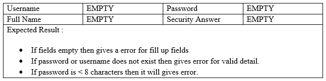
##### 4.2.4 Order Details
  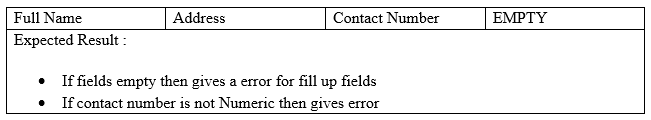

#### 4.3	Implementation approaches
Far the biggest challenge encountered was time constraints. Implementation takes an extraordinary amount of time and a large amount of coordination. Scheduling project meetings around every group member’s schedule has been nearly impossible. Many of the group members were unable to devote the amount of focus that the implementation stage required. Both the former and the latter problem may be more of an issue in the academic environment where priorities of the different group members are skewed in a variety of directions. Another issue that cropped up was knowledge of the PHP programming. At least two of the four group members were unfamiliar with PHP Swing API, which is php primary user interface package. Again, this may not be as much of an issue in software engineering outside the academic arena.

## Conclusion

#### 5.1 Limitation of system
-	Help
 Currently the help feature is not available. Using this functionality user can get help about the system.
-	Payment
Currently the feature of online payment is not available. User cannot give payment online.
-	Multilingual
Multilingual is not supported in our system. Therefore user cannot work in different languages.
-	Backup & Recovery:
User cannot take the backup or recover the data in this the system.
-	Many More Others.

#### 5.2 Future Scope of the System
-	Help module
Using this module user can get help on how to access the system. All functionalities of system are described in this module. And user can easily access the entire module using this feature.
-	Online payment module
User can do their payment online using this functionality. In future we will add the online payment for make payment easier for the user.
-	Multilingual
In this system we will add the multilingual therefore user can work in different languages and understand easily.

#### 5.3 Bibliography
##### Websites Used
-	www.google.com
-	www.w3cschools.com
-	www.stackoverflow.com
-	www.quora.com
-	www.Scribd.com
##### Apps Used
-	[Youtube](https://www.youtube.com/)
-	[Solo Learn](https://www.sololearn.com/en/)
-	[Udemy](https://www.udemy.com/)
