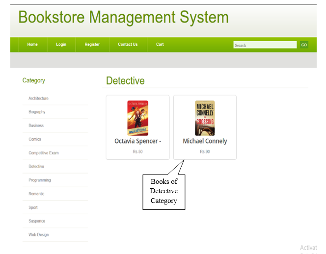
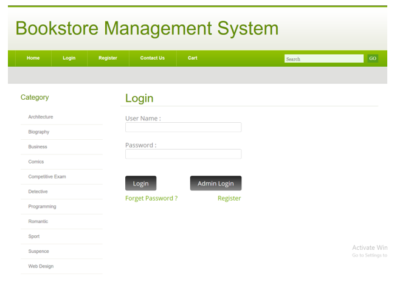
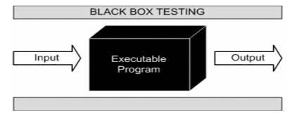
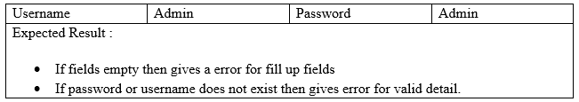

# Könyvesbolt Menedzsment Rendszer
## Tartalomjegyzék
#### [BEVEZETÉS](#1)
- [1.1 A projekt háttere](#11)
- [1.2 A projekt céljai](#12)
- [1.3 A projekt célja](#13)
- [1.4 A projekt hatóköre](#14)
- [1.5 A projekt alkalmazhatósága](#15)

#### [KÖVETELMÉNYEK ÉS ELEMZÉS](#2)
- [2.1 Probléma meghatározás](#21)
- [2.2 Követelmények specifikációi](#22)
- [2.3 Hardverkövetelmények](#23)
- [2.4 Szoftverkövetelmények](#24)
- [2.5 Tervezés és ütemezés](#25)

#### [RENDSZERTERVEZÉS](#3)
- [3.1 Teljes rendszerterv tervezőeszközökkel](#31)
- [3.2 Adatszótár](#32)
- [3.3 Bemenet/Kimenet tervezése](#33)

#### [TESZTELÉS ÉS MEGVALÓSÍTÁS](#4)
- [4.1 Alkalmazott tesztelési megközelítések](#41)
- [4.2 Tesztesetek](#42)
- [4.3 Megvalósítási megközelítések](#43)

#### [KÖVETKEZTETÉS](#5)
- [5.1 A rendszer korlátai](#51)
- [5.2 A rendszer jövőbeli hatóköre](#52)
- [5.3 Bibliográfia](#53)
  

## Bevezetés

#### 1.1 A projekt háttere
-	Ez a szoftver lehetővé teszi az adminisztrátor számára, hogy tárolja a könyvek és az ügyfelek adatait.
-	Könnyebb hozzáférés az információkhoz, mint az ügyféladatok és a könyvek elérhetősége.
-	Adattárolási lehetőség, amely csökkenti a papírmunkát.
-	A Könyvesbolt Menedzsment Rendszerben a felhasználók könyvet vásárolhatnak, és az adminisztrátor megjeleníti a nevüket és egyéb hátterüket.
-	Egy új ötlet a projekthez, hogyan működik a Könyvesbolt Menedzsment Rendszer.
A rendszer számítógépesítésének célja.

#### 1.2 A projekt céljai
-	A papírmunka csökkentése. A rendszer számítógépesítése.
-	Növelni a működési sebességet. Gyorsabb keresés és pontosság.
-	Nagy mennyiségű adat tárolása adatbázisban.
-	A manuális járművásárlási és eladási folyamat, valamint a heti, havi, éves jelentések generálása modell szerint nehézkes, így ez a projekt megkönnyíti ezt.
-	Gyorsabb és hatékonyabb információlekérés.

#### 1.3 A projekt célja
-	A Könyvesbolt Menedzsment Rendszer fő célja a papírmunkával kapcsolatos problémák megoldása.
-	Egy helyen biztosítja az összes tevékenység kezelését. Az adminisztrátor egyszerre több műveletet is végrehajthat ugyanabban az időben és helyen.
-	A rendszer képes biztonságosan tárolni a könyvekkel kapcsolatos adatokat.
-	A legjobb szolgáltatást nyújtjuk, és a felhasználó igényeire összpontosítunk. Új funkciókat fejlesztünk, hogy a felhasználók könnyen megértsék és bízzanak a rendszerben.

#### 1.4 A projekt hatóköre
-	A rendszer célja a túlórák csökkentése és a pontosan kezelhető rekordok számának növelése; a követelmények mind funkcionális, mind nem funkcionális szempontokat tartalmaznak.
-	Pontos és hatékony keresés, amely eredményeket biztosít a keresési művelet alkalmazásával.
-	A felhasználók néhány kattintással könyvet foglalhatnak.
-	Rugalmasan használható adatbázis, amely lehetővé teszi az adminisztrátor számára a hatékony felhasználást.
-	Az egyértelműség és érthetőség minden szinten biztosított.

#### 1.5 A projekt alkalmazhatósága:
-	Azok számára, akik bárhol és bármikor szeretnének könyvet vásárolni.
-	Az adminisztrátor számára, aki könyveket tud hozzáadni és listázni.
-	Az adatbázis adatok tárolására és lekérdezésére szolgál, így mind a felhasználók, mind az adminisztrátorok hozzáférhetnek az adatokhoz.

## Követelmények és elemzés

#### 2.1 Probléma meghatározás
-	Sok papírmunka.
-	Az eljárás időigényes.
-	Többletköltségek a papírmunkában.
-	Nagy mennyiségű adat tárolása.
-	A járművásárlás és -eladás manuális folyamata finanszírozással vagy készpénzzel, és jelentések generálása modell szerint nehézkes.
-	Gyorsabb információlekérés.
-	A manuális rendszer pontossága és következetessége alacsonyabb.
-	Személyes késedelem.
-	A manuális rendszerben nehéz feladat később egy adott rekordot keresni.
-	A személyzet növelése és időpazarlásuk.

#### 2.2 Követelmények specifikációja
##### Adminisztrátor funkciói:
-	Ez a modul elsősorban az alábbi feladatokat tartalmazza:
  -	Kategória hozzáadása.
  -	Kategória lista.
  -	Új könyv hozzáadása.
  -	Könyv megtekintése.
  -	Üzenetek megtekintése, amelyeket az ügyfelek küldtek.
##### Ügyfél funkciói:
-	Ez a modul elsősorban az alábbi feladatokat tartalmazza:
  -	Könyvek megtekintése.
  -	Könyvek hozzáadása a kosárhoz.
  -	Könyvek keresése.
  -	Tételek megtekintése vagy hozzáadása a kosárhoz.

#### 2.3 Hardverkövetelmények
-	Rendszertípus: 32 bites operációs rendszer.
-	Windows 7/8/8.1/10
-	Linux Ubuntu / Light Ubuntu
-	Mac OS
-	350 MB RAM

#### 2.4 Szoftverkövetelmények
-	Wamp Server
-	MySQL
-	Böngésző
-	PHPMyAdmin
##### Ügyféloldali eszközök
-	Processzor: PC dupla magos processzorral vagy annál jobbal - Ajánlott: 2,20 GHz processzor.
-	RAM: 512 MB vagy nagyobb ajánlott.
-	Merevlemez: 45 MB szabad hely szükséges a rendszermerevlemezen vagy több.
-	Operációs rendszer: Windows vagy nyílt forráskódú 32/64 bites operációs rendszer, vagy újabb verziók. Böngésző: Mozilla Firefox 2.0 / Internet Explorer 8.0 vagy újabb / Google Chrome.

#### 2.5 Tervezés és ütemezés
Különböző mennyiségű időre lehet szükség a projektciklus egyes szakaszainak befejezéséhez, attól függően, hogy a projektciklus kulcsfontosságú aspektusai hogyan alakulnak a fejlesztési folyamat során. A fejlesztés előtti szakaszban szerzett információk adnak lendületet a követelmények elemzéséhez, és ezeket az információkat használják a tervezési fázisban.
  
  

## Rendszertervezés

#### 3.1 Teljes rendszerterv tervezőeszközökkel
- A tervezési fázis célja egy megoldás kidolgozása a követelmények által meghatározott problémákra. A rendszertervezés célja azon modulok azonosítása, amelyeknek a rendszerben kell lenniük, valamint ezen modulok specifikációja és kölcsönhatásuk a végső eredmény érdekében. A tervezési folyamat célja egy olyan modell létrehozása, amely a rendszer későbbi építéséhez felhasználható. A létrehozott modell a rendszer terve.
  
  

#### 3.2 Adatszótár
-	Adatbázistervezés és struktúra tervezés
  
  
##### A rendszerben használt különféle táblák a következők:
1.	Adminisztrátor
2.	Könyv
3.	Kategória
4.	Kapcsolat
5.	Regisztráció
6.	Rendelés
##### Az összes tábla mezőinek részletezése:

#### 3.3 Bemenet/Kimenet tervezése
1.	Nyitóoldal
  
2.	Kiválasztott kategória
  
3.	Könyv részletei (Bejelentkezés előtt)
  
4.	Látogatói bejelentkezési oldal
  
5.	Regisztrációs oldal
  
6.	"Kapcsolatfelvétel" oldal
  

## Tesztelés és megvalósítás

#### 4.1 Alkalmazott tesztelési megközelítések
-	Fekete doboz tesztelés
A fekete doboz tesztelése egy olyan szoftvertesztelési módszer, amely a specifikációk alapján vizsgálja az alkalmazás funkcionalitását. Ez specifikáció alapú tesztelésként is ismert. A független tesztelő csapat általában ezt a tesztelési módszert alkalmazza a szoftvertesztelési életciklus során.
Ez a módszer alkalmazható a szoftvertesztelés minden szintjén, például egység, integráció, rendszer és elfogadási tesztelés.
  
-	Fehér doboz tesztelés
A fehér doboz tesztelés olyan tesztelési technika, amely a program szerkezetét vizsgálja, és a tesztadatokat a program logikájából/kódjából származtatja.
-	Szürke doboz tesztelés: 
A szürke doboz tesztelés egy olyan tesztelési technika, amelyet a rendszer belső működésének korlátozott információival végeznek. A tesztelők hozzáféréssel rendelkeznek a részletes tervezési információkhoz, amelyek az állapot alapú modellek vagy az UML diagramok alapján generálódnak.
  

#### 4.2 Tesztesetek
##### 4.2.1 Adminisztrátor bejelentkezési adatok
  
##### 4.2.2 Bejelentkezési adatok
  
##### 4.2.3 Regisztrációs adatok
  
##### 4.2.4 Rendelési adatok
  

#### 4.3 Megvalósítási megközelítések
A legnagyobb kihívás az időhiány volt. A megvalósítás rendkívül sok időt és koordinációt igényel. A projekt megbeszélések ütemezése a csoport minden tagjának időbeosztása szerint szinte lehetetlen volt. A PHP programozás ismeretének hiánya szintén probléma volt. Legalább két csoporttag nem volt ismerős a PHP Swing API használatában, amely a PHP elsődleges felhasználói felület csomagja.

## Következtetés

#### 5.1 A rendszer korlátai
-	Segítség
Jelenleg nincs elérhető súgófunkció. Ezzel a funkcióval a felhasználó segítséget kaphat a rendszerről.
-	Fizetés
Jelenleg az online fizetési funkció nem elérhető. A felhasználók nem tudnak online fizetést végrehajtani.
-	Többnyelvűség
A rendszer nem támogat több nyelvet, így a felhasználók nem tudnak különböző nyelveken dolgozni.
-	Mentés és helyreállítás
A felhasználók nem tudják a rendszertől adatokat menteni vagy visszaállítani.

#### 5.2 A rendszer jövőbeli hatóköre
-	Segítség modul
A felhasználó segítséget kaphat a rendszer használatával kapcsolatban. A rendszer összes funkciója leírásra kerül ebben a modulban, és a felhasználó könnyen hozzáférhet az összes modulhoz.
-	Online fizetési modul
A felhasználók online fizethetnek ezzel a funkcióval. A jövőben hozzáadjuk az online fizetést, hogy megkönnyítsük a felhasználók számára a fizetést.
-	Többnyelvűség
A jövőben hozzáadunk többnyelvűséget, így a felhasználók különböző nyelveken dolgozhatnak és könnyebben megérthetik a rendszert.

#### 5.3 Bibliográfia
##### Használt weboldalak
-	www.google.com
-	www.w3cschools.com
-	www.stackoverflow.com
-	www.quora.com
-	www.Scribd.com
##### Használt alkalmazások
-	[Youtube](https://www.youtube.com/)
-	[Solo Learn](https://www.sololearn.com/en/)
-	[Udemy](https://www.udemy.com/)
